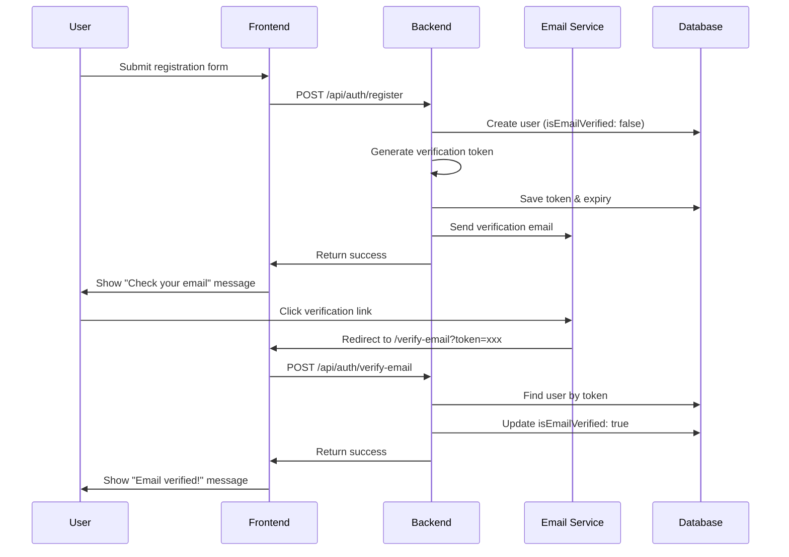

# Example: Email Verification Feature

This example demonstrates the complete workflow for adding email verification to an existing authentication system.

---

## Requirements Analysis

**User Story**: As a new user, I want to verify my email address so that the system knows I own the email account.

**Core Functionality**:
- User registers → receives verification email → clicks link → account activated
- Unverified users cannot access protected features
- Option to resend verification email

**Integration Points**:
- Existing User model
- Authentication system
- Email service

**Success Criteria**:
- User receives email within 30 seconds of registration
- Verification link activates account
- Unverified users see appropriate messaging

---

## Architecture Planning

### File Structure

**Backend** (Node.js/Express example):
```
/src
  /models
    User.js (modify: add isEmailVerified, verificationToken, verificationTokenExpiry)
  /services
    emailService.js (modify: add sendVerificationEmail function)
  /controllers
    authController.js (modify: update register, add verifyEmail, resendVerification)
  /middleware
    requireVerifiedEmail.js (new: check if user is verified)
  /routes
    auth.js (modify: add verification routes)
```

**Frontend** (React example):
```
/src
  /components
    /auth
      EmailVerificationBanner.jsx (new: prompt for unverified users)
      ResendVerificationButton.jsx (new: resend email action)
  /pages
    VerifyEmailPage.jsx (new: handle verification from email link)
  /hooks
    useAuth.js (modify: include isEmailVerified in user context)
```

### Data Flow



### Dependencies

- Existing: `nodemailer` or equivalent email library
- No new packages needed

---

## Implementation

### Step 1: Update Data Model

**File**: `/src/models/User.js`

```javascript
const userSchema = new Schema({
  // Existing fields...
  email: { type: String, required: true, unique: true },
  password: { type: String, required: true },
  
  // NEW: Email verification fields
  isEmailVerified: { type: Boolean, default: false },
  verificationToken: { type: String },
  verificationTokenExpiry: { type: Date },
  
  createdAt: { type: Date, default: Date.now }
});
```

### Step 2: Generate Verification Token

**File**: `/src/controllers/authController.js`

```javascript
const crypto = require('crypto');

exports.register = async (req, res) => {
  try {
    const { email, password, name } = req.body;
    
    // Check if user exists
    const existingUser = await User.findOne({ email });
    if (existingUser) {
      return res.status(400).json({ error: 'Email already registered' });
    }
    
    // Hash password
    const hashedPassword = await bcrypt.hash(password, 10);
    
    // Generate verification token
    const verificationToken = crypto.randomBytes(32).toString('hex');
    const verificationTokenExpiry = new Date(Date.now() + 24 * 60 * 60 * 1000); // 24 hours
    
    // Create user
    const user = await User.create({
      email,
      password: hashedPassword,
      name,
      isEmailVerified: false,
      verificationToken,
      verificationTokenExpiry
    });
    
    // Send verification email
    await emailService.sendVerificationEmail(
      email,
      verificationToken,
      name
    );
    
    res.status(201).json({
      message: 'Registration successful. Please check your email to verify your account.',
      userId: user._id
    });
    
  } catch (error) {
    console.error('Registration error:', error);
    res.status(500).json({ error: 'Registration failed' });
  }
};
```

### Step 3: Email Service

**File**: `/src/services/emailService.js`

```javascript
const nodemailer = require('nodemailer');

const transporter = nodemailer.createTransport({
  host: process.env.SMTP_HOST,
  port: process.env.SMTP_PORT,
  auth: {
    user: process.env.SMTP_USER,
    pass: process.env.SMTP_PASS
  }
});

exports.sendVerificationEmail = async (email, token, name) => {
  const verificationUrl = `${process.env.FRONTEND_URL}/verify-email?token=${token}`;
  
  const mailOptions = {
    from: process.env.EMAIL_FROM,
    to: email,
    subject: 'Verify Your Email Address',
    html: `
      <h1>Welcome, ${name}!</h1>
      <p>Please click the link below to verify your email address:</p>
      <a href="${verificationUrl}">Verify Email</a>
      <p>This link will expire in 24 hours.</p>
      <p>If you didn't register for an account, please ignore this email.</p>
    `
  };
  
  try {
    await transporter.sendMail(mailOptions);
    console.log('Verification email sent to:', email);
  } catch (error) {
    console.error('Failed to send verification email:', error);
    throw new Error('Email delivery failed');
  }
};
```

### Step 4: Verify Email Endpoint

**File**: `/src/controllers/authController.js`

```javascript
exports.verifyEmail = async (req, res) => {
  try {
    const { token } = req.body;
    
    // Find user with valid token
    const user = await User.findOne({
      verificationToken: token,
      verificationTokenExpiry: { $gt: Date.now() }
    });
    
    if (!user) {
      return res.status(400).json({ 
        error: 'Invalid or expired verification token' 
      });
    }
    
    // Update user
    user.isEmailVerified = true;
    user.verificationToken = undefined;
    user.verificationTokenExpiry = undefined;
    await user.save();
    
    res.json({ message: 'Email verified successfully!' });
    
  } catch (error) {
    console.error('Email verification error:', error);
    res.status(500).json({ error: 'Verification failed' });
  }
};
```

### Step 5: Middleware for Protected Routes

**File**: `/src/middleware/requireVerifiedEmail.js`

```javascript
module.exports = (req, res, next) => {
  if (!req.user) {
    return res.status(401).json({ error: 'Authentication required' });
  }
  
  if (!req.user.isEmailVerified) {
    return res.status(403).json({ 
      error: 'Email verification required',
      message: 'Please verify your email address to access this feature.'
    });
  }
  
  next();
};
```

### Step 6: Frontend Verification Page

**File**: `/src/pages/VerifyEmailPage.jsx`

```jsx
import { useEffect, useState } from 'react';
import { useSearchParams, useNavigate } from 'react-router-dom';
import axios from 'axios';

export default function VerifyEmailPage() {
  const [searchParams] = useSearchParams();
  const navigate = useNavigate();
  const [status, setStatus] = useState('verifying'); // verifying | success | error
  const [message, setMessage] = useState('');
  
  useEffect(() => {
    const token = searchParams.get('token');
    
    if (!token) {
      setStatus('error');
      setMessage('Invalid verification link');
      return;
    }
    
    verifyEmail(token);
  }, [searchParams]);
  
  const verifyEmail = async (token) => {
    try {
      const response = await axios.post('/api/auth/verify-email', { token });
      setStatus('success');
      setMessage(response.data.message);
      
      // Redirect to login after 3 seconds
      setTimeout(() => navigate('/login'), 3000);
      
    } catch (error) {
      setStatus('error');
      setMessage(error.response?.data?.error || 'Verification failed');
    }
  };
  
  return (
    <div className="verify-email-container">
      {status === 'verifying' && (
        <div>
          <h1>Verifying Email...</h1>
          <p>Please wait while we verify your email address.</p>
        </div>
      )}
      
      {status === 'success' && (
        <div className="success">
          <h1>✓ Email Verified!</h1>
          <p>{message}</p>
          <p>Redirecting to login...</p>
        </div>
      )}
      
      {status === 'error' && (
        <div className="error">
          <h1>Verification Failed</h1>
          <p>{message}</p>
          <button onClick={() => navigate('/login')}>
            Go to Login
          </button>
        </div>
      )}
    </div>
  );
}
```

### Step 7: Resend Verification

**File**: `/src/controllers/authController.js`

```javascript
exports.resendVerification = async (req, res) => {
  try {
    const { email } = req.body;
    
    const user = await User.findOne({ email });
    
    if (!user) {
      // Don't reveal if email exists
      return res.json({ 
        message: 'If that email is registered, a verification link has been sent.' 
      });
    }
    
    if (user.isEmailVerified) {
      return res.status(400).json({ error: 'Email already verified' });
    }
    
    // Generate new token
    const verificationToken = crypto.randomBytes(32).toString('hex');
    const verificationTokenExpiry = new Date(Date.now() + 24 * 60 * 60 * 1000);
    
    user.verificationToken = verificationToken;
    user.verificationTokenExpiry = verificationTokenExpiry;
    await user.save();
    
    await emailService.sendVerificationEmail(
      user.email,
      verificationToken,
      user.name
    );
    
    res.json({ 
      message: 'Verification email sent. Please check your inbox.' 
    });
    
  } catch (error) {
    console.error('Resend verification error:', error);
    res.status(500).json({ error: 'Failed to resend verification email' });
  }
};
```

---

## Verification

### Test Cases

**Test 1: Registration sends email**
1. POST to `/api/auth/register` with valid data
2. Check user created with `isEmailVerified: false`
3. Verify email sent (check logs or email inbox)

**Test 2: Verification link works**
1. Extract token from database
2. Navigate to `/verify-email?token=<token>`
3. Verify user status updated to `isEmailVerified: true`
4. Confirm redirect to login page

**Test 3: Expired token rejected**
1. Create user with expired token (set expiry in past)
2. Attempt to verify
3. Expect error message

**Test 4: Protected route blocks unverified users**
1. Login as unverified user
2. Attempt to access protected route
3. Expect 403 error with verification message

**Test 5: Resend verification**
1. POST to `/api/auth/resend-verification` with email
2. Verify new token generated
3. Confirm new email sent

---

## Configuration

Add to `.env`:
```
SMTP_HOST=smtp.sendgrid.net
SMTP_PORT=587
SMTP_USER=apikey
SMTP_PASS=your_sendgrid_api_key
EMAIL_FROM=noreply@yourapp.com
FRONTEND_URL=http://localhost:3000
```

---

## Summary

This feature adds email verification with:
- ✅ Token-based verification flow
- ✅ Email sending on registration
- ✅ Expiring verification links (24-hour window)
- ✅ Middleware to protect routes
- ✅ Resend verification option
- ✅ User-friendly frontend pages

**Total files changed**: 8
**Estimated implementation time**: 2-3 hours
**Testing time**: 1 hour
